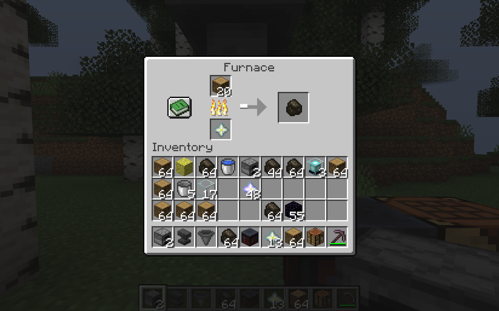
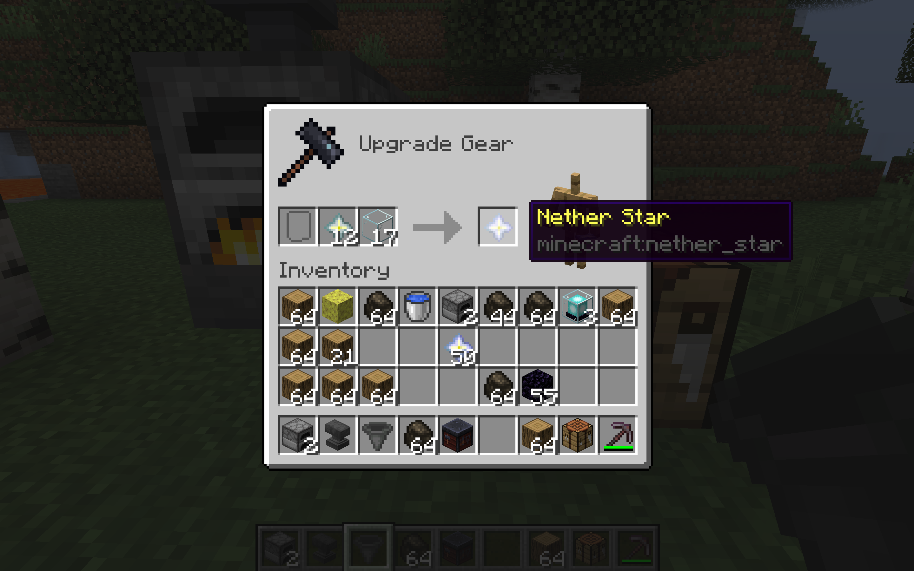

# InfiniteFuel
Makes the Nether Star a reusable fuel source that burns for 5 times as long as a lava bucket.
Once depleted, repair the nether star in a Smithing Table with any glass block to reuse.

